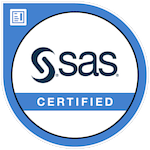

# Personal website of Andreas Frandsen

This is the repository to host the static source files of my personal website.

The content of all pages is licensed under [CC BY-NC-SA 4.0](https://creativecommons.org/licenses/by-nc-sa/4.0/).

Check it out: [https://afrandsen.rbind.io](https://afrandsen.rbind.io).

The website is built via the R package [blogdown](https://github.com/rstudio/blogdown).

## Certificates

